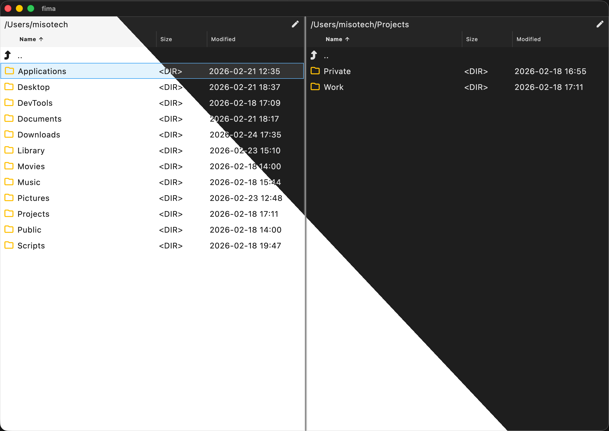

# fima



Fima is a modern, two-panel file manager built with Flutter, designed specifically for **programmers** who prefer keyboard-centric workflows. It is a cross-platform desktop application available for Linux, Windows, and macOS.

## Key Features

- **Keyboard First**: Navigate and control the entire application without leaving the keyboard.
- **Two-Panel Layout**: Classic dual-pane interface for efficient file management.
- **Cross-Platform**: Runs natively on Linux, Windows, and macOS.
- **Modern UI**: Clean and minimal interface with support for dark and light themes.

## Shortcuts

Maximize your productivity with these essential shortcuts:

| Action | Windows / Linux | macOS |
|--------|----------------|-------|
| **Go to File** | `Ctrl` + `P` | `Cmd` + `P` |
| **Command Palette** | `Ctrl` + `Shift` + `P` | `Cmd` + `Shift` + `P` |

## Getting Started

To run the application from source:

```bash
# Get dependencies
flutter pub get

# Run the app
flutter run
```
